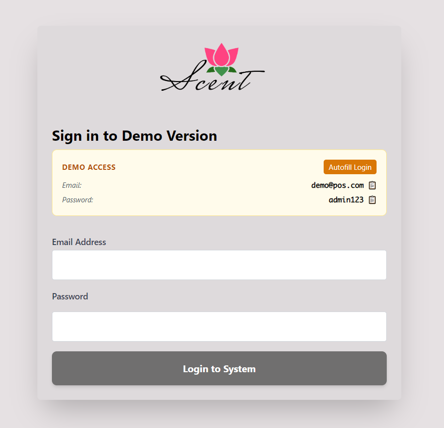
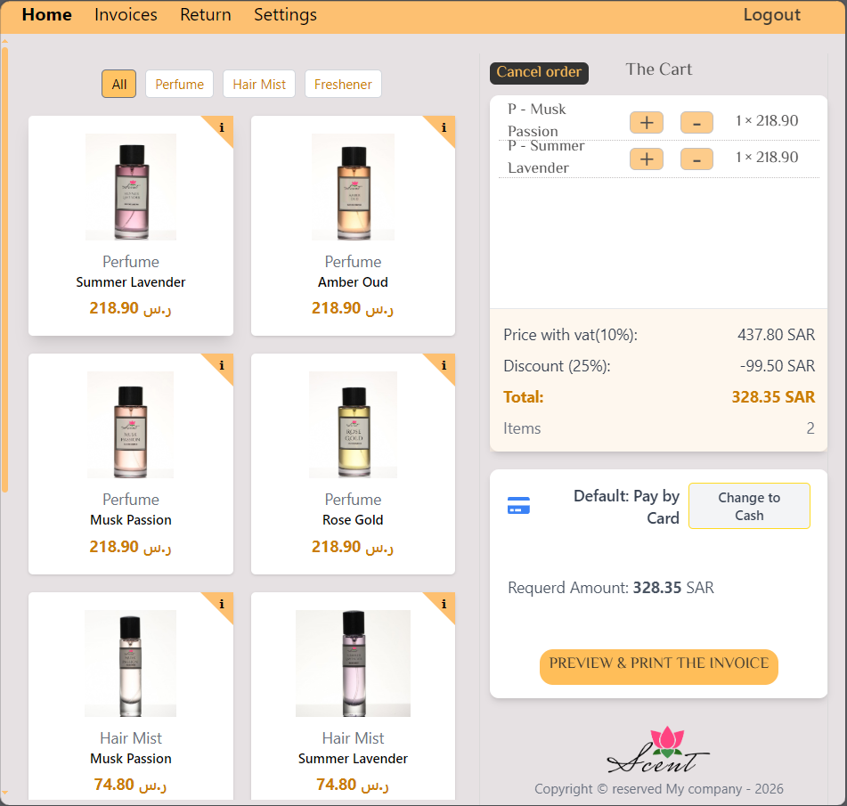
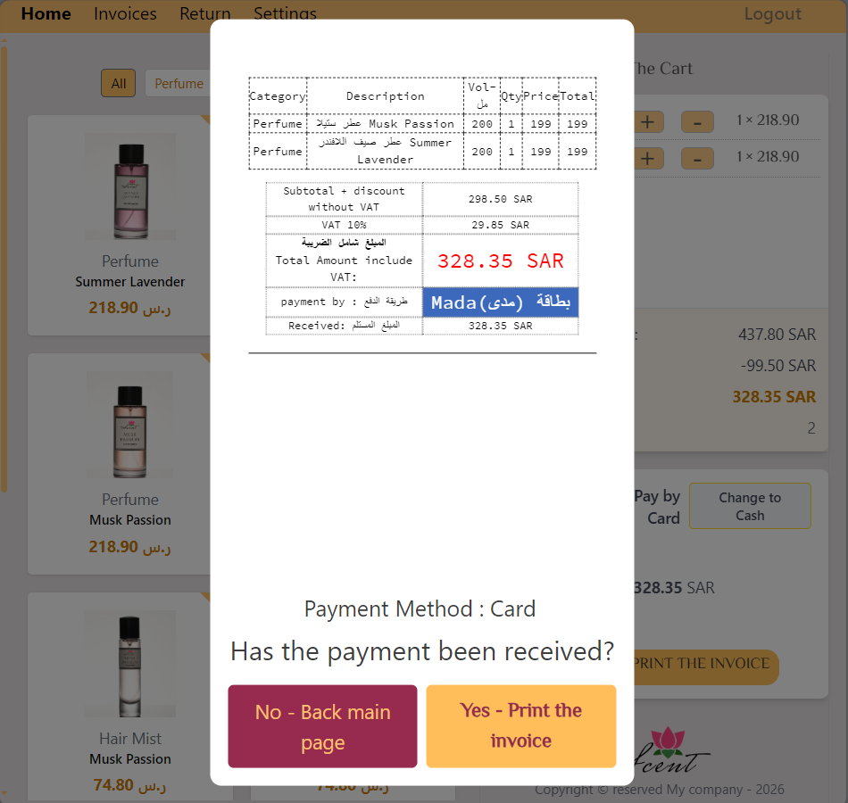
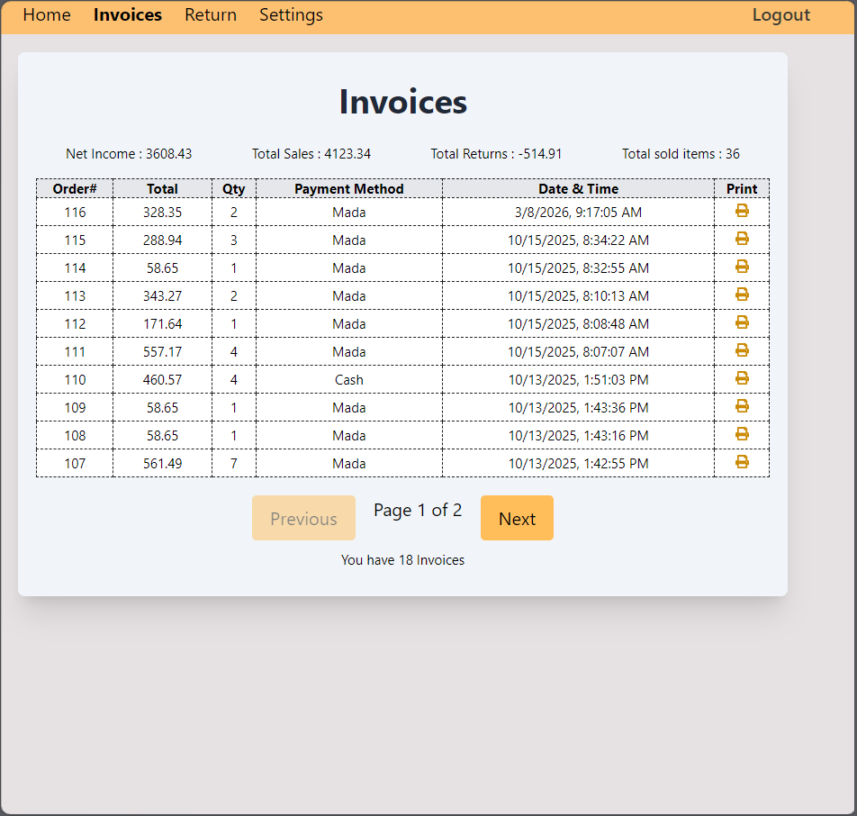
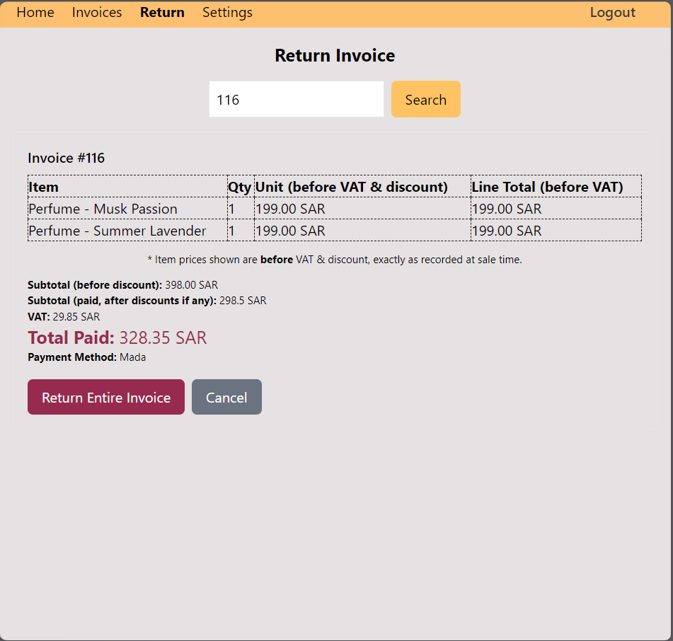
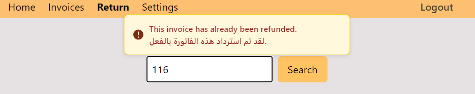
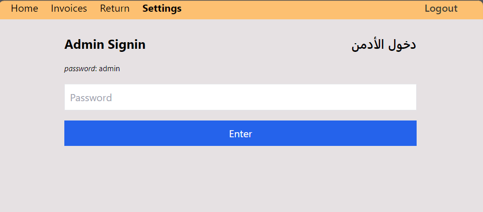
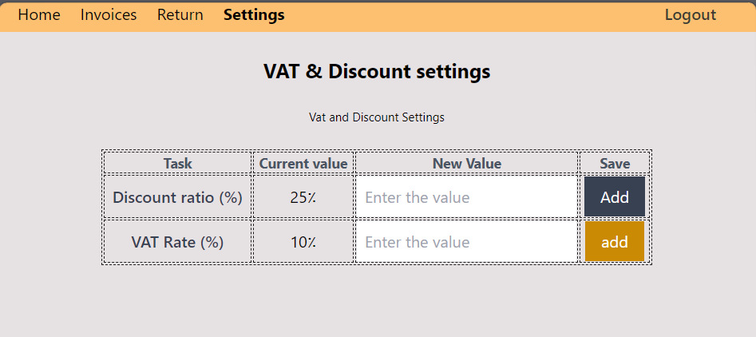

# 🧾 Local Sales & Invoicing Web App (Lightweight POS)

A lightweight, web-based Point of Sale (POS) system developed specifically for a private client. It was actually used in a live perfume exhibition, with full support for Saudi Electronic Invoicing requirements (ZATCA - Phase One).

The project went through several stages of development and improvement based on real-world feedback, which helped improve its structure and organization.

---

## 📸 Screenshots

| Login                        | Items & Cart                      |
| ---------------------------- | --------------------------------- |
|  |  |

| Preview before Printing        | Invoices                        |
| ------------------------------ | ------------------------------- |
|  |  |

| Return                               | Refunded                      |
| ------------------------------------ | ----------------------------- |
|  |  |

| Settings login                        | Settings                                     |
| ------------------------------------- | -------------------------------------------- |
|  |  |

## ⚙️ Core Features

- **Catalog**: Browse products with category filtering.
- **Cart:** Dynamic shopping cart with quantity adjustments and easy order cancellation.
- **Payment options**: cash or card.
- **Invoicing Preview & Printing**: Invoice preview and printing with a ZATCA-compatible QR code.
- **Invoicing History**: Invoice history with numbering and pagination.
- **Returns** Ability to process a full invoice return (refund), with detection for refuneded invoices.
- **Settings:** Global configuration for VAT and discounts. Any change is **immediately reflected in the cart totals**.

---

## 🧠 Technical Improvements & Challenges

The focus was on a robust structure and valuable development experiences:

- **Ensuring Data Accuracy:** Storing critical values (e.g., `subtotal`, `discountValue`, `vat`, `totalPrice`) at the time of invoice creation ensures historical records remain accurate, even if calculation logic changes later.
- **Code Refactoring:** Separating logic from the user interface, improving the flow of props, and reducing repetition between components.
- **Technical Challenges:** The system was deployed and used during a live perfume exhibition,handling real product catalog browsing, cart operations,and invoice generation compliant with ZATCA Phase One.
- **Environment Flexibility:** Transitioning from Firebase to LocalStorage in the demo version to protect customer data and provide a public experience.

---

## 🛠️ Technologies Used

- **Frontend:** React.js + JavaScript (ES6+)
- **Styling:** Tailwind CSS && CSS
- **Database (Original Version):** Firebase (Firestore + Auth)
- **Database (Demo Version):** LocalStorage
- **QR Code Generation:** `react-qr-code` library

---

## ⚠️ Demo Access & Limitations (Demo Version)

**Live Demo:** [myposify.netlify.net](https://myposify.netlify.app/)]  
**Credentials:** Use `demo@pos.com` / `admin123` to log in.

_Note: This demo version uses LocalStorage; clearing your browser cache will reset the data._

---

## 🚀 Installation & Setup

```bash
git clone or install it
npm install
npm run
```

---

**Developed by Wasim Al Mostafa** 🚀
